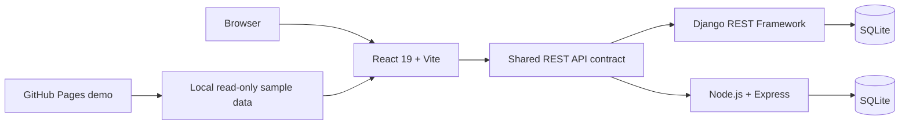

<div align="center">

# EventHub

### A full-stack event discovery and registration platform

Browse events, manage participant records, track registrations, and maintain schedules from one responsive workspace.

[](https://sorooshaghaei.github.io/web-programming-project/)
[](https://github.com/sponsors/sorooshaghaei)

[](frontend/)
[](frontend/)
[](backend/)
[](node/)
[](https://sorooshaghaei.github.io/web-programming-project/)

</div>

---

## Try it now

The public GitHub Pages build opens directly into a **read-only demonstration workspace** with realistic sample data. It requires no account and no backend server.

### [Open the live EventHub demo →](https://sorooshaghaei.github.io/web-programming-project/)

The demo lets visitors inspect the dashboard, event directory, event details, participant records, responsive navigation, filtering, statuses, and light/dark interface. Editing is intentionally disabled because GitHub Pages hosts static files only.

## What EventHub does

- Presents upcoming events with searchable and filterable views.
- Classifies events as **Open**, **Soon**, **Today**, or **Full**.
- Maintains a reusable participant directory without duplicate profiles.
- Connects participants and events through registration records.
- Prevents duplicate registration for the same participant and event.
- Supports confirmed, pending, and cancelled registration states.
- Provides JWT authentication and role-based administration in the full-stack version.
- Offers responsive layouts and persistent light/dark themes.

## Product views

| Area | Purpose |
| --- | --- |
| Dashboard | At-a-glance event, participant, capacity, and registration metrics |
| Events | Search, filter, inspect, create, edit, and remove event schedules |
| Event details | Review capacity, schedule information, and linked registrations |
| Participants | Search and maintain participant records across multiple events |
| Authentication | Registration, login, token refresh, and protected application routes |

## Architecture



The repository contains two independent backend implementations exposing the same core event-management concepts. This makes the project useful both as a working application and as a comparison of backend approaches.

## Repository structure

```text
web-programming-project/
├── frontend/   React 19 and Vite user interface
├── backend/    Django REST Framework API
├── node/       Node.js and Express comparative API
├── report/     LaTeX academic report workspace
└── .github/    GitHub Pages deployment and funding configuration
```

## Run locally

### 1. Frontend

```bash
cd frontend
npm install
npm run dev
```

The frontend uses `http://localhost:8000/api` by default. To connect another API:

```bash
VITE_API_BASE_URL=http://localhost:3001/api npm run dev
```

### 2. Django API

From the repository root:

```bash
python3 -m venv .venv
source .venv/bin/activate
pip install -r requirements.txt
cd backend
python manage.py migrate
python manage.py runserver
```

The Django API is available at `http://localhost:8000/api/`.

Create an administrator account with:

```bash
python manage.py createsuperuser
```

### 3. Express API

The comparative Express backend requires Node.js 22.

```bash
cd node
npm install
npm run dev
```

The Express API is available at `http://localhost:3001/api/`.

## Build and deployment

Build the frontend locally:

```bash
cd frontend
npm ci
npm run build
npm run preview
```

Every relevant push to `main` triggers the GitHub Actions workflow in `.github/workflows/deploy-pages.yml`. The workflow builds the read-only demo and publishes `frontend/dist` to GitHub Pages.

For a public **full-stack** installation, deploy the React frontend and one backend implementation separately, then set `VITE_API_BASE_URL` to the public API URL. The Django backend includes Gunicorn, WhiteNoise, CORS configuration, JWT authentication, and an optional persistent SQLite path for hosted environments.

## API domains

The full-stack application works with these primary resources:

```text
/api/auth/
/api/events/
/api/participants/
/api/registrations/
```

The frontend centralizes API access and token refresh so page components remain focused on product behavior and presentation.

## Support development

EventHub is maintained as an open development and portfolio project. Financial support can help cover hosting, testing, design work, and continued feature development.

[](https://github.com/sponsors/sorooshaghaei)

GitHub displays the repository-level **Sponsor** button from `.github/FUNDING.yml` after the maintainer's GitHub Sponsors profile is approved and activated.

## Contributing

Focused bug reports and pull requests are welcome. Before proposing a large feature, open an issue describing the user problem, expected behavior, and affected frontend or backend area.

## Project background

EventHub began as an integrated Web Programming 2026 project and was subsequently prepared as a public, deployable portfolio demonstration. The public demo emphasizes immediate product inspection, while the repository retains the complete React, Django, Express, database, and report workspaces.

---

<div align="center">

Maintained by [@sorooshaghaei](https://github.com/sorooshaghaei)

[Live demo](https://sorooshaghaei.github.io/web-programming-project/) · [Repository](https://github.com/sorooshaghaei/web-programming-project) · [Sponsor](https://github.com/sponsors/sorooshaghaei)

</div>
